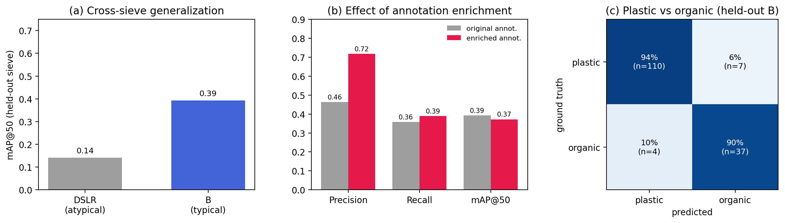

# CorSeaCare_yolo — manuscript results (recap, Figure 1, Table 1)

All metrics are **leakage-free** (held out by physical sieve; verified no shared tiles).
Full method/run log: [RESULTS.md](RESULTS.md). Figure source: `scripts/make_figures.py`.

## Results recap (prose)

We trained a tiled YOLO11n detector to detect, count and classify marine plastic particles on
sieve photographs into five plastic morphotypes (`fragment`, `fibre`, `film`, `mousse`,
`pellet`) and an organic/indeterminate class (`autre`). On a **held-out sieve never seen in
training**, cross-sieve detection performance depended strongly on how typical the test sieve
was: mAP@50 = 0.14 on an atypical sieve (`DSLR`) versus 0.39 on a representative sieve (`B`),
with recall (~0.3–0.4) the main bottleneck. Crucially, **once a particle was detected, the
model discriminated plastic from organic matter with ~92–93 % accuracy** (stable across IoU
0.3–0.5), indicating that the limiting factor is detection completeness rather than the
plastic/organic decision.

A vision-model-assisted review of the detector's apparent false positives showed that **74 % of
them were in fact real particles missing from the ground truth** — i.e. the manual annotation
was ~one-third incomplete, and the model's real precision was ~86 %, not the ~47 % suggested by
the incomplete labels. Completing the annotations through an AI-assisted enrichment loop
(high-confidence model proposals + human review) and retraining **raised held-out precision
from 0.46 to 0.72** at equal mAP, with discrimination unchanged (Figure 1b). Finally, because
each sieve was photographed under several physical re-distributions of the same material, we
quantified test-retest reproducibility: total counts were reproducible to ~±16 % and the
dominant-class (fragment) proportion to ~±7 %, while rare classes (`fibre`, `mousse`) remained
unreliable owing to scarce examples.

## Figure 1



**Figure 1.** (a) Cross-sieve generalization: mAP@50 on a held-out sieve, atypical (`DSLR`) vs
representative (`B`). (b) Effect of AI-assisted annotation enrichment on the same held-out
benchmark (`B`): completing the training annotations raises precision markedly at equal mAP.
(c) Plastic-vs-organic confusion among detected particles on held-out `B` (row-normalized;
~92 % correct).

## Table 1 — held-out evaluation (sieve-level, leakage-free)

| Experiment | Train sieves | Held-out test | mAP@50 | mAP@50-95 | Precision | Recall |
|---|---|---|---|---|---|---|
| Cross-sieve, atypical | MANTA + B + C | DSLR | 0.142 | 0.054 | 0.24 | 0.17 |
| Cross-sieve, typical | MANTA + DSLR + C | B | 0.393 | 0.190 | 0.46 | 0.36 |
| + enriched annotation | MANTA + DSLR + C (enriched) | B (enriched) | 0.372 | 0.189 | **0.72** | 0.39 |

Plastic vs organic (held-out B): **92–93 %** correct classification given detection.
Inter-view reproducibility (same material re-distributed): count CV ≈ ±16 %, fragment-proportion
CV ≈ ±7 %. MANTA = an external public collection used as auxiliary training data only.

### Table 1 (LaTeX)

```latex
\begin{table}[t]
\centering
\caption{Held-out evaluation (sieve-level, leakage-free).}
\label{tab:results}
\begin{tabular}{llccccc}
\hline
Experiment & Train & Held-out & mAP@50 & mAP@50-95 & Precision & Recall \\
\hline
Cross-sieve, atypical & MANTA+B+C & DSLR & 0.142 & 0.054 & 0.24 & 0.17 \\
Cross-sieve, typical & MANTA+DSLR+C & B & 0.393 & 0.190 & 0.46 & 0.36 \\
\;+ enriched annot. & MANTA+DSLR+C (enr.) & B (enr.) & 0.372 & 0.189 & \textbf{0.72} & 0.39 \\
\hline
\end{tabular}
\end{table}
```
